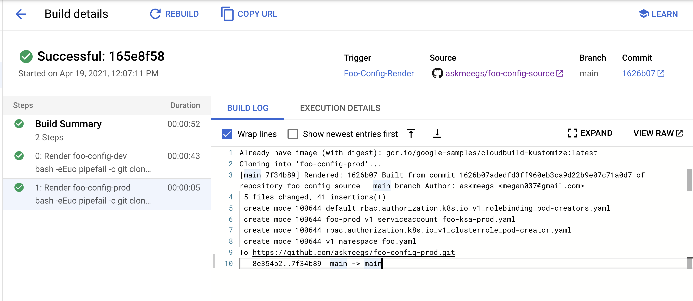
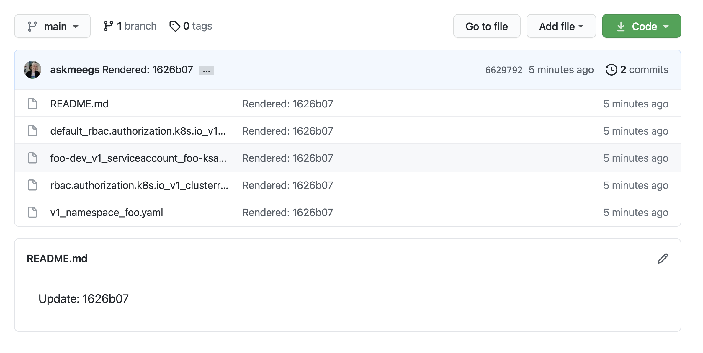

#  Using ConfigSync with Multiple Environs 

This guide shows you how to set up Config Sync for GKE across two Environs, dev and prod, using config management best practices. 

## Overview 


You'll set up the following: 

- 2 Google Cloud projects representing `dev` and `prod` environments 
- 2 GKE clusters, `dev` and `prod`, in the separate projects
- 3 GitHub repos, `foo-config-source`, `foo-config-dev`, and `foo-config-prod`. These are ConfigSync unstructured repos containing YAML config. 
- ConfigSync installed to both clusters - the dev cluster synced to `foo-config-dev`, the prod cluster synced to `foo-config-prod`. 
- 3 Secret Manager secrets with your Git username and a developer token, used by Cloud Build to commit to those Github repos 
- A Cloud Build pipeline, triggered on pushed to the `foo-config-source`. This pipeline uses `kustomize build` to "hydrate" the `foo-config-dev` and `foo-config-prod` repos with YAML config, using the "Base" and "overlays" in `foo-config-source`. These kustomize overlays have been provided to you in `config-source/`. 

## Prerequisites 

- 2 Google Cloud projects
- kubectx tool 
- nomos tool 
- A Github account with a personal access token
  
## Steps 

1. **Set variables** 

```
export DEV_PROJECT=""
export PROD_PROJECT=""
export DEV_CLUSTER_ZONE=""
export PROD_CLUSTER_ZONE=""
export GITHUB_USERNAME=""
export GITHUB_TOKEN=""
export GITHUB_EMAIL=""
```

2. **Create 1 cluster in each of the 2 projects.** 

```
./1-create-clusters.sh
```

3. **Register clusters to separate Anthos environs.** 

```
./2-register-clusters.sh
```

4. **Create 3 github repos.** 

```
./3-create-repos.sh
```

5. **Create secret manager secrets in the prod project with your Git credentials**. This will allow Cloud Build to push to Github on your behalf. 

```
./4-secret-manager-git.sh
```

6. **Open the Cloud Console in your prod project, and navigate to Cloud Build**. Click Triggers > Manage Repositories > Connect Repository. Check the `foo-config-source` repo, then click **Done.** 


7. **From the Cloud Build dashboard, create a Trigger** from the `foo-config-source` repo with the following fields: 

- **Trigger name**: Foo-Config-Hydration
- **Event**: push to a new branch
- **Repository**: foo-config-source
- **Branch**: `^main$`
- **Type**: Autodetected (`cloudbuild.yaml`)


Click **Create**. 

8. Because we already pushed to the foo-config-source repo before creating this trigger, **let's run it manually to trigger the hydration of the dev and prod repos**. In the triggers list, in the `Foo-Config-Hydration` row, click **Run** on the right side of the screen and use the default branch value, `main`. The build should run successfully, writing the output of `kustomize build` to the `foo-config-dev` and `foo-config-prod` repos, respectively. 



9. **Once the build completes, open one of the dev or prod repos.** You should see YAML files populating the repo, and a README update indicating the commit SHA of the `foo-config-source` repo that this repo was last built from. 



10. **Install ConfigSync** on both clusters. 

```
./5-install-config-sync.sh
```

11. **Run `nomos status`.** You should see that both your dev and prod clusters are now `synced` to their respective repos. 

```
dev
  --------------------
  <root>   https:/github.com/askmeegs/foo-config-dev@main
  SYNCED   f111be7d

*prod
  --------------------
  <root>   https:/github.com/askmeegs/foo-config-prod@main
  SYNCED   f15cddf1
```

12. **Switch to the `dev` cluster.** Get namespaces to verify that the resources are synced - you should see a `foo` and `bar`  namespace appear. 


```
kubectx dev
kubectl get namespace 
```

Expected output: 

```
NAME                           STATUS   AGE
config-management-monitoring   Active   86m
config-management-system       Active   86m
default                        Active   102m
foo-dev                        Active   9m42s
gke-connect                    Active   98m
kube-node-lease                Active   102m
kube-public                    Active   102m
kube-system                    Active   102m
```